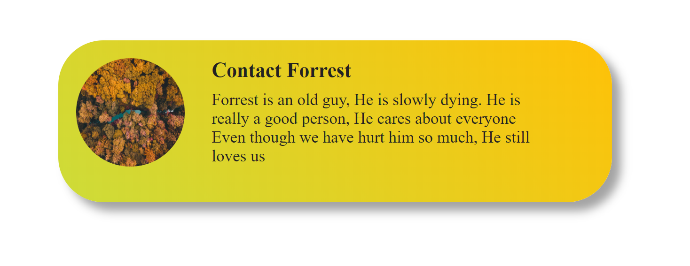

<p align="center">
    
</p>
<p align="center">Coat.JS</p>

# A light ass CSS runtime autocompleter
No need to type exact css property. Coat.js autocompletes

```
<div coat="m:1vw p:1vw">😄</div>        >     <div style="margin:1vw; padding:1vw;">😄</div>
<div coat="mar:1vw pad:1vw">😄</div>    >     <div style="margin:1vw; padding:1vw;">😄</div>
<div coat="mar:1vw pa:1vw">😄</div>     >     <div style="margin:1vw; padding:1vw;">😄</div>


<div coat="bo:0.1vw:solid:#555">😄</div>    >     <div style="border:0.1vw solid #555;">😄</div>
<div coat="bor:0.1vw:solid:#555">😄</div>   >     <div style="border:0.1vw solid #555;">😄</div>


<div coat="borderr:1vw">😄</div>    >      <div style="border:radius:1vw">😄</div>
<div coat="borderRa:1vw">😄</div>   >      <div style="border:radius:1vw">😄</div>

```

# How to use?

Just inlude coat.js and forget about it. No configuration needed

```
import {coat} from 'https://cdn.jsdelivr.net/gh/itsarnavsingh/coat/coat.js'

or

<script type="module" src="https://cdn.jsdelivr.net/gh/itsarnavsingh/coat/coat.js"> </script>

```
<h3>Get your hands dirty with demo files @ ./demos/</h3>

# Media Query
Coat.js is Mobile First

Prefix 'pc-' For Laptops and PC

Prefix 'tablet-' For Tablets

```
<div coat="pc-m:1vw p:1vw">😄</div>  
```

# Example


```
 
    //JS
    import {extraCoat} from '../coat.js'
    extraCoat.main = ' di:grid pI:center c:#fff'
    extraCoat.image = 'pI:center bRa:100vw m:2vw w:12vw  h:12vw b:#000 flo:left'
    extraCoat.title = ' fS:xl'
    extraCoat.desc = ' fS:m m:1vw w:60% flo:left'


    //HTML
    <body coat="fFa:roboto; c:#222 bSha:1vw 1vw 1vw #0000005c b:linear-gradient(45deg, #CDDC39, #FFC107)  mTo:2vw ov:hidden bRa:5vw w:62% pBo:2vw">

        <div coat="bSha:1vw 1vw 1vw #0000005c  mTo:2vw ov:hidden bRa:5vw w:62% b:#000 pBo:2vw">
            
            
            <div coat="desc fS:l">
                <h3 coat="title fS:xl mTo:1vw mBo:1vw"> Contact Forrest </h3>
                Forrest is an old guy, He is slowly dying.
                He is really a good person, He cares about everyone
                Even though we have hurt him so much, He still loves us
            </div>
        
        </div>
    </body>
```

# Motivations

* less CSS best CSS
* mobile first css library
* easy inline media query
* Replace Big Ass Tailwind 
* coat.js is compatible will all component library because of the way it works

# FAQ

<h3>What if dom is updated? can coat.js handle that?</h3>
Coat.JS listens for dom changes and parses coat style for only that element. No unnecessary processing is done 